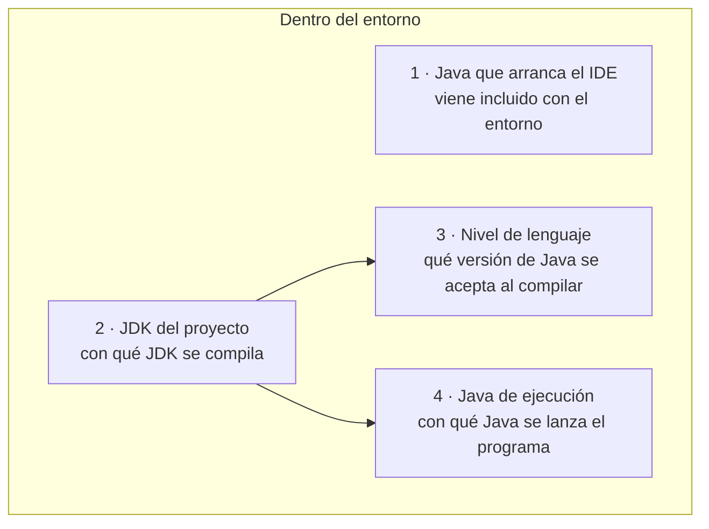
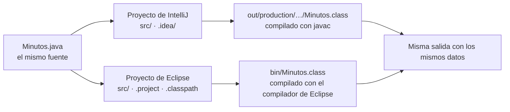

# CO3 · Entornos de desarrollo

**Contornos de desenvolvemento · 1º DAM · Apuntes**

---

## Al terminar esta unidad vas a saber

- Explicar qué hace cada pieza de un entorno de desarrollo y qué parte es del
  lenguaje.
- Instalar **IntelliJ IDEA** y **Eclipse**, y comprobar que trabajan con Java 25.
- Construir y ejecutar el mismo programa en los dos, y encontrar lo que genera
  cada uno.
- Añadir, desactivar, quitar y recuperar complementos.
- Personalizar el entorno y guardar una forma de ejecutar que no tengas que
  repetir a mano.
- Decidir cómo se actualiza un entorno sin que te rompa el trabajo.
- Ejecutar Java y Python desde el mismo entorno.
- Comparar entornos con medidas y observaciones propias, y recomendar uno con
  argumentos.

Vas a instalar dos entornos, hacer lo mismo en los dos y registrar las
diferencias. Un tercero, **Visual Studio Code**, se estudia como caso de
referencia, sin instalarlo.

Todo lo que hagas queda en **un informe en PDF** que se va rellenando mientras
trabajas. Cómo se hace ese PDF está en el apartado 0, y se aprende el primer día.

---

## Cómo están escritos estos apuntes

Cada procedimiento tiene siempre las mismas partes:

| Parte | Para qué |
|---|---|
| **Antes de empezar** | Lo que tiene que estar hecho, para no atascarte a mitad |
| **Pasos** | Qué hacer, en orden |
| **Comprobación** | Qué tienes que ver en pantalla para saber que ha salido bien |
| **Si falla** | Los fallos más frecuentes y cómo salir de ellos |

Los menús están escritos como aparecen en la versión de referencia de cada
entorno, en inglés, porque es el idioma en que vienen instalados. Si en tu
versión algo ha cambiado de sitio, **búscalo por su nombre**:

| Entorno | Buscador de ajustes y acciones |
|---|---|
| IntelliJ IDEA | `Ctrl+Mayús+A` (*Find Action*) o el cuadro de búsqueda de *Settings* |
| Eclipse | `Ctrl+3` (*Quick Access*) o el cuadro de búsqueda de *Preferences* |

### Versiones de referencia

| Herramienta | Versión con la que están escritos los pasos |
|---|---|
| JDK | Java 25, el mismo que instalaste con la guía de entorno de Java |
| IntelliJ IDEA | 2026.2 (distribución única de JetBrains) |
| Eclipse IDE for Java Developers | 2026-09 |
| Python | 3.13 |
| PyDev (complemento de Python para Eclipse) | 13.x |

Los programas de ejemplo de estos apuntes están en `entornos/recursos/CO3/ejemplos/`.

---

## 0. El informe: capturas, PDF y declaración de IA

En esta unidad no entregas código: entregas **evidencias** de lo que has hecho en
el entorno. Casi todas son una captura con una frase debajo. Si no sabes hacer el
PDF, el trabajo no llega, así que esto se aprende antes que nada.

### Antes de empezar

- La plantilla editable del informe, `entornos/recursos/CO3/plantilla_informe_CO3.docx`,
  copiada en tu carpeta de trabajo. Se abre con Word o con LibreOffice Writer.
  (Existe también en Markdown, `plantilla_informe_CO3.md`, con el mismo contenido.)
- Guárdala con tu nombre desde el principio: `CO3_apellido_nombre.docx`.

### Pasos: una evidencia completa

1. **Captura.** Con lo que quieres enseñar en pantalla, pulsa `Win+Mayús+S`. La
   pantalla se oscurece y arriba aparece una barra: elige **recorte rectangular**
   y arrastra sobre la zona que importa. La captura queda en el portapapeles.
2. **Recorta a lo legible.** Que se vea lo que demuestra (la salida, el panel, la
   ruta) y poco más. Una pantalla completa reducida a un sello no se lee. Si
   necesitas dos zonas separadas, haz dos capturas.
3. **Pégala en su apartado** de la plantilla: coloca el cursor debajo del
   encabezado de la actividad y `Ctrl+V`.
4. **Escribe debajo una frase** que diga qué demuestra: «La consola de Eclipse
   muestra *Ejecutado con Java 25.0.x*».
5. **Guarda** el documento editable (`Ctrl+S`). El `.docx` es tu original: el PDF
   se vuelve a sacar de él cada vez que añadas algo.

### Pasos: sacar el PDF y comprobarlo

| Procesador | Cómo se exporta |
|---|---|
| Microsoft Word | *Archivo → Exportar → Crear documento PDF/XPS* (o *Archivo → Guardar como* y tipo *PDF*) |
| LibreOffice Writer | *Archivo → Exportar a PDF…* → *Exportar*, o el botón *Exportar directamente como PDF* |

1. Exporta con el nombre `CO3_apellido_nombre.pdf`.
2. **Ciérralo y vuelve a abrirlo** con el visor de PDF. No compruebes en el
   procesador: compruebas lo que vas a entregar.
3. Revisa página a página: que ninguna tabla ni captura salga cortada por el borde
   de la página y que cada captura se lea sin ampliar.

### Comprobación

El PDF abre, tiene tu nombre en el fichero, y cada captura se lee y lleva su frase.

### Si falla

| Lo que ves | Qué pasa | Qué hacer |
|---|---|---|
| `Win+Mayús+S` no hace nada | La herramienta de recortes está desactivada o el foco está en otra ventana | Busca *Recortes* en el menú Inicio y usa *Nuevo* |
| Una tabla o una captura sale cortada en el PDF | Es más ancha que la página | En el `.docx`, reduce la captura (arrastra una esquina) o gira esa página a horizontal; vuelve a exportar |
| La captura no se lee | Has capturado la pantalla entera | Repite el recorte solo sobre la zona que importa |
| El PDF sale sin las últimas capturas | Has exportado antes de guardar | Guarda el `.docx` y exporta de nuevo |

### La declaración de uso de IA, dentro del mismo PDF

La plantilla termina con un **anexo de uso de IA**. Va en el mismo PDF, no en un
fichero aparte. Sigue el protocolo del curso (`evaluacion/PROTOCOLO_IA_1DAM.md`).

- **Si no has usado IA**, escribe una línea: *«No he usado IA en esta entrega.»*
  Vale igual y no resta nada.
- **Si la has usado**, una entrada por consulta relevante con seis datos:
  1. **Objetivo y resultado esperado**, escrito antes de preguntar.
  2. **Contexto compartido** y qué dejaste fuera.
  3. **Petición y respuesta**, resumidas.
  4. **Decisión**: qué aceptaste, cambiaste o rechazaste, y por qué.
  5. **Ajuste o fichero revisado**: en esta unidad casi nunca hay repositorio ni
     commit. Anota el valor **antes y después** del ajuste, o el fichero que
     cambió. No inventes un commit que no existe.
  6. **Prueba real**: qué ejecutaste y qué salió.

**Ejemplo resuelto, sobre configuración del entorno:**

```markdown
**Objetivo y resultado esperado:** que la consola de Eclipse muestre bien las
tildes de Minutos. Esperaba ver «año, canción, pequeño, acción».

**Contexto compartido:** el texto roto que salía («año») y la versión de
Eclipse. No pegué el enunciado de la práctica ni datos míos.

**Petición y respuesta:** pregunté qué ajuste de Eclipse decide la
codificación de la consola. Me dijo que la configuración de ejecución
(Common → Encoding) o la general del espacio de trabajo, y también que editase
el fichero eclipse.ini.

**Decisión:** acepté cambiar la configuración de ejecución. Rechacé tocar
eclipse.ini: afecta a todo Eclipse y no entiendo qué más cambia.

**Ajuste revisado:** configuración de ejecución «Minutos», pestaña Common,
Encoding. Antes: Default (windows-1252). Después: UTF-8.

**Prueba real:** ejecuté Minutos desde esa configuración. La última línea
dice «Texto de prueba: año, canción, pequeño, acción».
```

### Entregar en Classroom

1. Abre la tarea de CO3 en Classroom. La fecha de entrega es la que figura allí.
2. En *Tu trabajo*: **Añadir o crear → Archivo**, y elige
   `CO3_apellido_nombre.pdf`.
3. Comprueba que aparece adjunto **el PDF**, no el `.docx`, y pulsa **Entregar**.

---

## 1. Qué es un entorno de desarrollo

En CO1 compilaste y ejecutaste a mano: escribías el fuente en un editor de texto,
lo compilabas con `javac` y lo lanzabas con `java`. Cada herramienta era un
programa distinto y tú hacías de pegamento entre ellas.

Un **entorno de desarrollo integrado** (IDE) junta esas herramientas en un solo
programa y las coordina. No las sustituye: sigue habiendo un compilador y una
máquina virtual, solo que ahora los lanza el entorno.


| Pieza | Qué hace | Sin IDE lo hacías con |
|---|---|---|
| Editor | Escribir el código, con colores y ayudas | Un editor de texto plano |
| Análisis del código | Marcar errores mientras escribes y proponer cómo completar | Nada: el error aparecía al compilar |
| Compilador | Traducir `.java` a `.class` | `javac` |
| Ejecución | Lanzar el programa en la JVM | `java` |
| Depurador | Parar el programa y mirar sus variables | `jdb`, el depurador de consola del JDK. En CO1 todavía no usaste ninguno; el del IDE se ve en CO5 |
| Gestión del proyecto | Saber qué ficheros forman el programa y dónde dejar lo generado | Carpetas y órdenes a mano |
| Control de versiones | Git desde menús | `git` en la consola, que es como se trabaja en CO4 |

### Editor, IDE, lenguaje

Tres palabras que se confunden a menudo:

| | Qué es | Ejemplo |
|---|---|---|
| **Lenguaje** | Las reglas para escribir el programa y lo que significan | Java, Python |
| **Herramientas del lenguaje** | Los programas que traducen y ejecutan ese lenguaje | JDK (`javac`, `java`), intérprete de Python |
| **Entorno** | El programa desde el que trabajas y que lanza esas herramientas | IntelliJ IDEA, Eclipse, VS Code |

Un editor de código como VS Code, sin ampliaciones, se queda en la primera fila de
la tabla anterior. Con las extensiones adecuadas se comporta como un IDE. Por eso
el límite entre «editor» e «IDE» es borroso, y lo que importa es qué funciones
tienes disponibles.

### Precio y licencia son dos cosas distintas

Que un programa sea **gratis** habla del precio. Que sea **libre** habla de lo que
te deja hacer su licencia: usarlo con cualquier fin, estudiar cómo funciona,
modificarlo y redistribuirlo, con cambios o sin ellos. Un programa libre tiene
igualmente autores y titulares de derechos, y se puede vender. Un programa
gratuito puede no dejarte ver ni tocar su código.

| Entorno | Precio | Licencia | Quién lo distribuye |
|---|---|---|---|
| **Eclipse IDE** | Gratis | **Libre** (Eclipse Public License 2.0) | Eclipse Foundation |
| **IntelliJ IDEA** | Las funciones de Java que usamos son gratuitas; otras son de pago | **Propietaria** | JetBrains |
| **Visual Studio Code** | Gratis | La distribución de Microsoft tiene **licencia propietaria**; el código del que sale, **Code - OSS**, es libre (MIT) | Microsoft |

> **Si ves instrucciones que hablan de «IntelliJ IDEA Community Edition»**, son
> anteriores a finales de 2025. Desde la versión 2025.3, JetBrains distribuye un
> único IntelliJ IDEA: las funciones básicas de Java y Kotlin no necesitan
> suscripción, y las avanzadas se desbloquean pagando. Ya no hay una descarga
> separada llamada *Community*.

---

## 2. Preparar el puesto

### Antes de empezar

- El JDK 25 instalado y comprobado con la **guía de puesta en marcha de Java**
  del curso (`programacion/GUIA_ENTORNO_JAVA.md`). Estos apuntes no repiten esa
  instalación.
- Una carpeta de trabajo para la unidad, por ejemplo `Documents\dam\co3`. Si en tu
  aula el disco se limpia al reiniciar, sigue la norma de guardado que se indique
  en clase.

### Pasos: inventario del equipo

1. **Sistema y memoria.** Tecla Windows → escribe *Información del sistema* →
   Enter. Anota la edición de Windows y la *Memoria física instalada (RAM)*.
2. **Espacio libre.** Explorador de archivos → *Este equipo*. Anota el espacio
   libre del disco donde vas a instalar.
3. **Java.** Abre una consola (el Terminal de Windows abre PowerShell) y escribe:

   ```
   java --version
   where.exe java
   ```

   La primera orden dice **qué versión** se ejecuta. La segunda, **desde qué
   carpeta**: si aparecen varias líneas, manda la primera.


### Comprobación

`java --version` empieza por `openjdk 25` o `java 25`, y `where.exe java` da al
menos una ruta que termina en `\bin\java.exe`. Si dice otra versión, vuelve a la
guía de Java antes de seguir: un IDE no arregla un JDK mal instalado, solo lo
esconde.

### Antes de instalar: prepara las medidas

En el apartado 11 vas a comparar los dos entornos con medidas. **Dos de ellas
solo se pueden tomar ahora o en la instalación**, y si se pasan no vuelven:

| Medida | Cuándo se toma | Cómo |
|---|---|---|
| **Primera apertura** | La primera vez que abres cada entorno, justo después de instalarlo | Cronómetro del móvil o del reloj de Windows preparado **antes** de pulsar el icono. Empieza al pulsar; termina cuando puedes escribir en el editor. Anótala en la tabla de medidas del informe en ese momento |
| **Tamaño instalado** | En cuanto termina cada instalación | Explorador de archivos → clic derecho sobre la carpeta de instalación → *Propiedades* → **Tamaño en disco** |

La carpeta de instalación la eliges o la ves en el propio instalador (por ejemplo,
`C:\Program Files\JetBrains\IntelliJ IDEA 2026.2` o la carpeta donde descomprimas
Eclipse). Anótala.

Si un entorno ya se abrió sin medir, en el informe se escribe **«no registrada»**.
No se reinstala para medir otra vez, y no se escribe un valor recordado a ojo ni supuesto.

### Los cuatro «Java» de un entorno

Esta es la idea que más problemas evita en toda la unidad. Cuando trabajas con un
IDE, **hay cuatro decisiones distintas sobre Java**, y cada una se configura en un
sitio:



| | Qué decide | Dónde lo ves |
|---|---|---|
| **1 · El Java que arranca el IDE** | Con qué se ejecuta el propio entorno. IntelliJ trae el suyo (*JetBrains Runtime*) y Eclipse también (*JustJ*) | Normalmente no se toca |
| **2 · El JDK del proyecto** | Qué JDK usa el proyecto para compilar | IntelliJ: *Project Structure*. Eclipse: *Installed JREs* y la biblioteca *JRE System Library* del proyecto |
| **3 · El nivel de lenguaje** | Qué versión del lenguaje se acepta. Con nivel 21, la forma `void main()` de Java 25 da error aunque el JDK sea el 25 | IntelliJ: *Language level*. Eclipse: *Compiler compliance level* |
| **4 · El Java de ejecución** | Con qué JVM se lanza tu programa | La configuración de ejecución de cada programa |

Las cuatro son **independientes**, pero en este curso queremos que la 2, la 3 y
la 4 apunten al **mismo JDK 25** que usas en la consola. La 1 no hace falta
cambiarla: que el IDE arranque con su propio Java es normal y no afecta a tus
programas.

Cuando «en la consola funciona y en el IDE no», o al revés, la pregunta es
siempre la misma: **¿cuál de los cuatro no apunta a donde creo?**

---

## 3. IntelliJ IDEA: instalar y construir un proyecto

### Antes de empezar

- Inventario hecho y `java --version` diciendo 25.
- El instalador de IntelliJ IDEA para Windows. Se descarga de la página oficial de
  JetBrains (`jetbrains.com/idea/download`). En el aula puede estar ya descargado
  en la carpeta que se indique en clase.
- El fichero `entornos/recursos/CO3/ejemplos/Minutos.java`.

### Pasos: instalar

1. Ejecuta el instalador. Acepta la carpeta que propone salvo que en clase se
   indique otra, y **anota esa carpeta**.
2. En *Installation Options* puedes marcar el acceso directo del escritorio.
   No hace falta marcar nada más.
3. Al terminar, **antes de abrirlo**, mide el tamaño de la carpeta instalada y
   prepara el cronómetro para la primera apertura (apartado 2).
4. Abre IntelliJ con el cronómetro en marcha. Acepta el acuerdo de usuario; cuando
   te pregunte si quieres enviar estadísticas de uso, puedes decir que no. La
   primera apertura termina cuando, ya con el proyecto creado en los pasos
   siguientes, puedes escribir en el editor.
5. Anota la versión exacta: *Help → About*.

### Pasos: crear el proyecto

1. En la pantalla de bienvenida, **New Project**.
2. A la izquierda, **Java**.
3. Rellena:

   | Campo | Valor |
   |---|---|
   | *Name* | `ejemplo-minutos` |
   | *Location* | tu carpeta de CO3, por ejemplo `Documents\dam\co3\intellij` |
   | *Build system* | **IntelliJ** (no Maven ni Gradle) |
   | *JDK* | el **25** |
   | *Add sample code* | desmarcado |

   Si el JDK 25 no aparece en la lista: *Add JDK from disk…* y señala la carpeta
   donde se instaló, normalmente `C:\Program Files\Eclipse Adoptium\jdk-25…`.
4. **Create**.

IntelliJ crea la carpeta del proyecto con esto dentro:

| Qué | Para qué |
|---|---|
| `src/` | Tu código fuente |
| `.idea/` y `ejemplo-minutos.iml` | La configuración del proyecto que guarda IntelliJ. No se edita a mano |
| `out/` | Lo que genera al construir. Aparece la primera vez que construyes |

### Pasos: añadir el fuente y fijar el nivel de lenguaje

1. En el Explorador de archivos, copia `Minutos.java`. En IntelliJ, clic derecho
   sobre `src` → **Paste**. Así el fichero queda **copiado** dentro del proyecto,
   no enlazado al original.
2. *File → Project Structure* (`Ctrl+Alt+Mayús+S`) → **Project**. Comprueba:

   | Campo | Tiene que decir |
   |---|---|
   | *SDK* | 25 |
   | *Language level* | *SDK default* (que es 25) o **25** |
   | *Compiler output* | una carpeta `out` dentro del proyecto |

### Pasos: construir y ejecutar

1. *Build → Build Project* (`Ctrl+F9`). Esto **solo compila**: no ejecuta nada.
2. Localiza el resultado. En el panel del proyecto, abre `out/production/ejemplo-minutos/`.
   Ahí está `Minutos.class`. Si no ves `out`, mira qué carpeta dice *Compiler
   output* en *Project Structure*.
3. Ejecuta: abre `Minutos.java` y pulsa la flecha verde que aparece junto a
   `void main()` → **Run 'Minutos'**.
4. Ejecuta el mismo `.class` **desde fuera del IDE**, para ver que lo generado es
   un programa de verdad y no algo que solo entiende IntelliJ. Abre una consola en
   la carpeta del proyecto (o *View → Tool Windows → Terminal*) y escribe:

   ```
   java -cp out\production\ejemplo-minutos Minutos
   ```

   `-cp` dice a la JVM **en qué carpeta buscar las clases**. Aquí no le das el
   `.java`: le das el `.class` que ha generado IntelliJ.

### Comprobación

Las dos ejecuciones, la del IDE y la de la consola, muestran:

```
Conversión de duraciones · versión Java
135 minutos son 2 h y 15 min
Texto de prueba: año, canción, pequeño, acción
```

### Si falla

| Lo que ves | Qué pasa | Qué hacer |
|---|---|---|
| Aviso de *Project JDK is not defined* o *Setup SDK* | El proyecto no tiene JDK asignado | *Project Structure → Project → SDK* y elige el 25 |
| `void main()` subrayado en rojo, con un mensaje sobre el nivel de lenguaje | El *Language level* es anterior a 25 | Súbelo a 25 en *Project Structure* |
| No aparece la flecha verde | El fichero no está dentro de `src` o el proyecto no ha terminado de indexar | Espera a que termine la barra de progreso de abajo y comprueba que el fichero cuelga de `src` |
| `Error: Could not find or load main class Minutos` en la consola | La consola no está en la carpeta del proyecto, o la ruta de `-cp` no es la carpeta de salida | `dir out\production\ejemplo-minutos` tiene que listar `Minutos.class` |
| `UnsupportedClassVersionError` en la consola | La consola usa un Java más antiguo que el que ha compilado | `java --version` y `where.exe java`: la consola no está usando el JDK 25 |

---

## 4. Eclipse: el mismo recorrido con otras piezas

### Antes de empezar

- El paquete **Eclipse IDE for Java Developers**, descargado de
  `eclipse.org/downloads/packages`. Se puede instalar con el *Eclipse Installer* o
  descomprimiendo el paquete en una carpeta. Los dos caminos dan el mismo entorno.
- El JDK 25 comprobado.

### Espacio de trabajo y proyecto

Eclipse organiza el trabajo en dos niveles, y es lo primero que desconcierta si
vienes de IntelliJ:

| | Qué es | Qué guarda |
|---|---|---|
| **Workspace** (espacio de trabajo) | Una carpeta que Eclipse te pide al arrancar | Tus preferencias de ese espacio y, por defecto, las carpetas de los proyectos |
| **Proyecto** | Una carpeta dentro del espacio de trabajo | El código, la configuración del proyecto (`.project`, `.classpath`, `.settings/`) y lo generado |

Un mismo Eclipse puede abrir espacios de trabajo distintos, y cada uno tiene sus
preferencias. Por eso, **un ajuste hecho en un espacio de trabajo no aparece en
otro**.

### Pasos: instalar y abrir

1. Instala o descomprime Eclipse y **anota la carpeta**. Antes de abrirlo, mide el
   tamaño de esa carpeta y prepara el cronómetro para la primera apertura
   (apartado 2). Anota la versión cuando esté abierto: *Help → About Eclipse IDE*.
2. Al abrirlo, te pide un **workspace**. Elige una carpeta dentro de tu carpeta de
   CO3, por ejemplo `Documents\dam\co3\eclipse-ws`.
3. Cierra la pestaña de bienvenida (*Welcome*).

### Pasos: dar de alta el JDK 25

Eclipse trae su propio Java para arrancar, que puede no ser el 25. Para compilar
tus proyectos hay que decirle dónde está el JDK 25.

1. *Window → Preferences → Java → Installed JREs*.
2. Si el JDK 25 no está en la lista: **Add… → Standard VM → Next**. En *JRE home*
   señala la carpeta del JDK 25. **Finish**.
3. Marca la casilla del JDK 25 para que sea el predeterminado. **Apply**.
4. En *Java → Installed JREs → Execution Environments*, selecciona **JavaSE-25**
   y comprueba que a la derecha aparece marcado tu JDK 25.

### Pasos: crear el proyecto

1. *File → New → Java Project*.
2. Rellena:

   | Campo | Valor |
   |---|---|
   | *Project name* | `ejemplo-minutos` |
   | *JRE* | *Use an execution environment JRE*: **JavaSE-25** |
   | *Project layout* | *Create separate folders for sources and class files* |
   | *Create module-info.java file* | **desmarcado** |

   El `module-info.java` convierte el proyecto en un módulo, y un módulo no admite
   clases sin paquete como las de este curso. Si se ha creado, bórralo.
3. **Finish**.

### Pasos: añadir el fuente, comprobar el compilador y construir

1. Copia `Minutos.java` desde el Explorador de archivos. En el *Package Explorer*,
   clic derecho sobre `src` → **Paste**.
2. Clic derecho sobre el proyecto → *Properties → Java Compiler*. El *Compiler
   compliance level* tiene que ser **25**. Si está marcado *Enable project specific
   settings*, el valor que manda es el de esta pantalla; si no, el general de
   *Preferences*.
3. Eclipse compila **cada vez que guardas** si está activado *Project → Build
   Automatically*, que viene activado. Para forzar una construcción completa:
   *Project → Clean…*, elige el proyecto y marca que construya después.
4. Localiza el resultado. El *Package Explorer* oculta la carpeta de salida; para
   verla: *Window → Show View → Navigator*. Dentro del proyecto verás
   `bin/Minutos.class`.
5. Ejecuta: clic derecho sobre `Minutos.java` → *Run As → Java Application*.
6. Desde la consola, en la carpeta del proyecto:

   ```
   java -cp bin Minutos
   ```

### Comprobación

La misma salida que en IntelliJ, en la consola de Eclipse y en la del sistema.

### No es el mismo compilador

IntelliJ, por defecto, compila con el `javac` del JDK. Eclipse compila con **su
propio compilador**, el de sus herramientas de Java (JDT). Los dos siguen la misma
especificación del lenguaje, así que el programa **se comporta igual**, pero los
`.class` que generan **no tienen por qué ser idénticos byte a byte**. Lo que se
compara entre entornos es el comportamiento: la misma salida con los mismos datos.

### Si falla

| Lo que ves | Qué pasa | Qué hacer |
|---|---|---|
| *Unbound classpath container: 'JRE System Library [JavaSE-25]'* | El entorno de ejecución JavaSE-25 no tiene ningún JDK asociado | Vuelve a *Installed JREs → Execution Environments* y asocia el JDK 25 |
| Error en `void main()` que habla del nivel o de la versión del código fuente | El *Compiler compliance level* es menor que 25 | *Properties → Java Compiler* → 25 |
| *Run As* no ofrece *Java Application* | El fichero tiene errores de compilación o no está en `src` | Mira la vista *Problems* (*Window → Show View → Problems*) |
| Error sobre el paquete o el módulo | Se creó `module-info.java` | Bórralo |
| No encuentras `bin` | El *Package Explorer* no la enseña | Vista *Navigator* |

---

## 5. Un mismo fuente en dos entornos

Cada entorno guarda su configuración de forma distinta: IntelliJ en `.idea/` y el
`.iml`; Eclipse en `.project`, `.classpath` y `.settings/`. Esas carpetas **no se
copian de un entorno a otro**. Lo que se comparte es **el fuente**.

### Pasos

1. Cada entorno tiene **su propio proyecto**, en su propia carpeta.
2. El mismo `.java` se **copia** en el `src` de cada uno.
3. Se construye en cada entorno y se localiza lo generado.
4. Se ejecuta en cada entorno **con los mismos datos**.
5. Se comprueba que la salida coincide.



### Rutas relativas y directorio de trabajo

Cuando un programa abre un fichero por su nombre, sin ruta completa, lo busca a
partir del **directorio de trabajo** de la ejecución. En los dos entornos, por
defecto, ese directorio es **la carpeta del proyecto**, no la de `src` ni la de
salida. Si un programa no encuentra un fichero que «está ahí», casi siempre es
porque no está donde la ejecución lo busca. Lo verás en el apartado 8.

### Qué se genera y qué no

| Paso | Resultado | ¿Es un ejecutable? |
|---|---|---|
| Escribir | `Minutos.java`, código fuente | No: es texto |
| Compilar | `Minutos.class`, **bytecode** | Lo ejecuta la JVM, no Windows directamente |
| Ejecutar | La JVM carga el `.class` y lo ejecuta | — |
| Empaquetar (ampliación) | `minutos.jar`, un fichero que reúne los `.class` | También necesita una JVM: `java -jar minutos.jar` |

Pulsar *Run* en un IDE compila lo que haga falta y ejecuta, pero **no genera un
`.exe`**. Un programa Java compilado es un conjunto de `.class`, y lo que se
distribuye normalmente es un `.jar`. Para comprobarlo, con el `.class` ya
generado, desde la carpeta de salida:

```
jar --create --file minutos.jar --main-class Minutos Minutos.class
java -jar minutos.jar
```

### Una copia de trabajo para experimentar

Cuando vayas a romper algo a propósito para ver qué pasa, **no lo hagas en el
proyecto bueno**. Se hace una **copia de trabajo**: un proyecto nuevo, con otro
nombre y en otra carpeta, al que solo se le copia **el fuente**. Cada proyecto
tiene así su propia configuración del entorno, y lo que cambies en la copia no
puede tocar al original.

No se copia la carpeta entera del proyecto: arrastraría `.idea/` o `.settings/`, y
según el entorno podría acabar con dos proyectos que comparten nombre o salida.

**Antes de empezar:** el proyecto original (`ejemplo-minutos`) construye y ejecuta
bien.

**Pasos**

1. **Ejecuta el original** y guarda la salida: es la referencia con la que
   compararás al final.
2. **Crea el proyecto copia** con otro nombre, `ejemplo-minutos-copia`, con los
   mismos valores que el original (apartado 3 en IntelliJ, apartado 4 en Eclipse):
   JDK 25, nivel 25 y, en Eclipse, sin `module-info.java`.
   - En IntelliJ se abre en otra ventana: elige *New Window* si pregunta.
3. **Copia el fuente.** Desde el Explorador de archivos, copia `Minutos.java` de la
   carpeta `src` del original y pégalo en `src` de la copia (clic derecho sobre
   `src` → *Paste*).
4. **Comprueba que las rutas son distintas.**
   - IntelliJ: en el panel del proyecto, al lado del nombre de la carpeta raíz,
     aparece en gris su ruta.
   - Eclipse: clic derecho sobre el proyecto → *Properties → Resource* →
     *Location*.

   Las dos rutas tienen que terminar en `ejemplo-minutos` y `ejemplo-minutos-copia`.
5. **Construye y ejecuta la copia.** Tiene que dar la misma salida que el original.
6. Ahora sí: **provoca el fallo solo en la copia**, observa, y restaura.
7. **Verifica la copia restaurada** (construye y ejecuta: misma salida) **y el
   original** (ejecútalo otra vez: misma salida que en el paso 1).

**Comprobación.** Dos proyectos con rutas distintas; la copia, tras restaurar, da
la salida de referencia; el original la sigue dando sin haberlo tocado.

### Ejemplo resuelto de incidencia: el JDK que ya no está

Es el fallo de configuración más típico al llevar un proyecto a otro equipo, o al
reinstalar Java.

**Situación.** Un proyecto se creó con un JDK instalado en una carpeta que ya no
existe (se desinstaló, o el proyecto viene de otro ordenador).

**Síntoma.** El proyecto se abre, pero todo el código aparece en rojo: no
reconoce ni `String`. Al construir no se genera nada.

**Diagnóstico.** Si no reconoce ni las clases básicas del lenguaje, el problema no
está en tu código: está en la pieza 2 de los cuatro «Java». El proyecto apunta a un
JDK que no encuentra.

- En IntelliJ: *Project Structure → Project → SDK* aparece en rojo o vacío.
- En Eclipse: en *Problems* aparece *Unbound classpath container*, o errores del
  tipo *The type java.lang.Object cannot be resolved*, y la biblioteca *JRE System
  Library* del proyecto falta o está marcada con error.

**Cómo reproducirlo en la copia de trabajo (Eclipse).** No hace falta desinstalar
ningún JDK: basta con quitarle al proyecto copia su biblioteca de Java.

1. En `ejemplo-minutos-copia`: clic derecho → *Properties → Java Build Path →
   Libraries*.
2. Selecciona **JRE System Library [JavaSE-25]** → **Remove** → *Apply and Close*.
3. Observa: `Minutos.java` se llena de rojo y la vista *Problems* se llena de
   errores sobre tipos que no se pueden resolver.

**Solución.** Asignar al proyecto un JDK que sí exista (el 25) en esa misma
pantalla. En Eclipse: *Java Build Path → Libraries* → selecciona *Modulepath* o
*Classpath* → **Add Library… → JRE System Library → Execution environment:
JavaSE-25** → *Finish* → *Apply and Close*. En IntelliJ: *Project Structure →
Project → SDK* → el 25. **No** se arregla reescribiendo el código ni reinstalando
el IDE.

**Comprobación.** Desaparecen los errores, la copia construye y ejecuta con la
salida de referencia, y el original, que no se ha tocado, sigue dando la misma.

---

## 6. Complementos

### Vocabulario

| Palabra | Qué es |
|---|---|
| **Complemento** (*plugin* en IntelliJ y Eclipse, *extensión* en VS Code) | Un añadido que da al entorno una función nueva |
| **Paquete** | Un conjunto de complementos que se instala de una vez. El *Extension Pack for Java* de VS Code, por ejemplo, instala seis |
| **Dependencia** | Algo que un complemento necesita para funcionar. Si falta, el complemento no se instala o no arranca |
| **Incluido** (*bundled*) | Complemento que viene de serie con el entorno |

### Cuatro operaciones distintas

| Operación | Qué pasa | Cómo se deshace |
|---|---|---|
| **Instalar** | Se descarga y se añade al entorno | Desinstalando |
| **Desactivar** | Sigue en el disco, pero el entorno no lo carga | Activándolo otra vez. Es inmediato y no hay que descargar nada |
| **Desinstalar** | Se borra del entorno | Instalándolo de nuevo |
| **Actualizar** | Se cambia por una versión más nueva | Depende del entorno; a veces no se puede |

Casi todas piden **reiniciar el entorno** para que el cambio se note.

### Qué cuesta un complemento

Un complemento **puede** ocupar disco, usar memoria, alargar el arranque o
trabajar en segundo plano (por ejemplo, analizando todo el proyecto). **Puede, no
siempre lo hace**: muchos solo se cargan cuando abres un tipo de fichero concreto.
Por eso no se afirma «este complemento ralentiza» sin haberlo medido. Una medida
honesta puede dar **«sin diferencia apreciable»**, y es un resultado válido.

La regla práctica es otra: **instala lo que vayas a usar**, sabe qué hace cada
cosa que tienes instalada, y quita lo que no uses. No por velocidad, sino para
saber qué tienes.

### Ciclo completo en Eclipse: PyDev

PyDev es el complemento que permite trabajar con Python en Eclipse. Se usa en el
apartado 10, y aquí sirve para practicar el ciclo entero. Es un buen candidato
porque su efecto se ve enseguida: sin PyDev, Eclipse no sabe crear proyectos de
Python.

**Antes de empezar: qué necesita PyDev.** Son tres piezas distintas, y solo una es
el complemento:

| Pieza | Qué es | Cómo compruebas que está |
|---|---|---|
| **El complemento PyDev** | Lo que instalas ahora, dentro de Eclipse | Después de instalarlo: *File → New → Project…* muestra la carpeta **PyDev** |
| **El Java que arranca Eclipse** | La pieza 1 de los cuatro «Java». PyDev exige que sea **17 o posterior** | *Help → About Eclipse IDE → Installation Details → Configuration*: busca la línea `java.version=` |
| **Un intérprete de Python** | Programa aparte, instalado fuera de Eclipse. Sin él, PyDev se instala pero no puede ejecutar nada | `python --version` y `where.exe python` en una consola. Se instala en el apartado 10 |

Para hacer el ciclo del complemento solo hacen falta las dos primeras. El
intérprete se necesita cuando vayas a ejecutar Python.

**Y además:** Eclipse cerrado y abierto de nuevo, sin nada a medias.

**1 · Instalar**

1. *Help → Eclipse Marketplace…*
2. Busca `PyDev`. En el resultado **PyDev - Python IDE for Eclipse**, **Install**.
3. Acepta la licencia. Eclipse puede pedir que confirmes que **confías en el
   origen o en el certificado** del complemento: comprueba que es de PyDev y
   acepta.
4. Reinicia cuando lo pida.

Otra vía equivalente, si el Marketplace no carga: *Help → Install New Software…*,
y en *Work with* escribe la dirección de actualizaciones de PyDev,
`https://www.pydev.org/updates`.

**2 · Comprobar que funciona**

*File → New → Project…*: tiene que aparecer una carpeta **PyDev**. Anota la
versión instalada en *Help → About Eclipse IDE → Installation Details →
Installed Software*.

**3 · Desinstalar y comprobar que ya no está**

1. *Help → About Eclipse IDE → Installation Details → Installed Software*.
2. Selecciona PyDev → **Uninstall…** → confirma → reinicia.
3. *File → New → Project…*: la carpeta **PyDev ya no aparece**.

**4 · Reinstalar y comprobar que vuelve**

Repite el paso 1. Vuelve a aparecer la carpeta PyDev. Las preferencias que
hubieras guardado en el espacio de trabajo suelen conservarse, pero **compruébalo**
antes de dar nada por hecho.

### Desactivar sin desinstalar: IntelliJ

IntelliJ trae muchos complementos incluidos. Uno fácil de observar es
**Markdown**, que muestra una vista previa de los ficheros `.md`.

1. Crea un fichero `prueba.md` en el proyecto con un título (`# Hola`) y ábrelo.
   Se ve el editor y la vista previa.
2. *File → Settings → Plugins → Installed*. Busca **Markdown** y desmárcalo (o
   *Disable*). Reinicia.
3. Abre `prueba.md`: ya no hay vista previa; es texto plano.
4. Vuelve a marcarlo y reinicia: la vista previa regresa.

No desactives complementos que no sepas qué hacen, y nunca los de soporte de Java:
el entorno dejaría de entender tu código.

---

## 7. Personalizar el entorno

### El alcance de un ajuste

Antes de cambiar nada, pregúntate **a quién afecta**:

| Alcance | Afecta a | IntelliJ | Eclipse |
|---|---|---|---|
| **Entorno** | Todo lo que abras con ese entorno | *Settings* sin marca de proyecto | — |
| **Espacio de trabajo** | Todos los proyectos de ese workspace | — | *Window → Preferences* |
| **Proyecto** | Solo ese proyecto | *Settings* con el icono de proyecto, y *Project Structure* | *Properties* del proyecto |
| **Ejecución** | Solo esa forma de ejecutar | La configuración de ejecución | La configuración de ejecución |

Un ajuste que «no funciona» a menudo está bien hecho, pero en otro alcance.

### Codificación: comprobar, no suponer

En CO1 viste que el texto se guarda con una codificación y que la consola tiene la
suya. En un entorno hay **tres sitios** donde se decide:

| Dónde | IntelliJ | Eclipse |
|---|---|---|
| El fichero | Barra de estado, abajo a la derecha, con el fichero abierto | Clic derecho sobre el fichero → *Properties → Resource → Text file encoding* |
| El proyecto | *Settings → Editor → File Encodings*: *Project Encoding* | *Properties* del proyecto → *Resource → Text file encoding* |
| Valor general | *Settings → Editor → File Encodings*: *Global Encoding* | *Preferences → General → Workspace → Text file encoding* |
| La consola de la ejecución | *Settings → Editor → General → Console*: *Default Encoding* | Configuración de ejecución → pestaña *Common → Encoding* |

En todos, **UTF-8**. Con Java 25 y los entornos actuales lo normal es que ya
venga así; lo que hay que hacer es **comprobarlo con una salida real**, no fiarse
de la pantalla de ajustes.

**La codificación efectiva.** Un fichero puede tener su propio valor o **heredar**
el del proyecto, y el proyecto el general. Lo que manda es la que se aplica al
final, la **efectiva**, y los entornos la enseñan así:

- En Eclipse, en las *Properties* del fichero, *Text file encoding* dice
  *Default (inherited from container: UTF-8)* si hereda, u *Other: …* si tiene uno
  propio. Lo mismo en las del proyecto (*inherited from container* quiere decir
  que manda el valor del espacio de trabajo).
- En IntelliJ, el valor de la barra de estado es el efectivo del fichero. En
  *File Encodings* se ve si el proyecto o una carpeta tienen un valor propio.

**Ejemplo resuelto: comprobar las tres piezas y la salida**

1. Abre `Minutos.java` y mira la codificación efectiva del **fichero**: UTF-8.
2. Mira la del **proyecto**: UTF-8, propia o heredada.
3. Abre la configuración de ejecución de `Minutos` (en Eclipse, *Run →
   Run Configurations…* → *Minutos* → *Common*; en IntelliJ, el ajuste de consola):
   UTF-8.
4. Ejecuta `Minutos` y lee la última línea.

**Comprobación:** tiene que leerse `año, canción, pequeño, acción`. Si ves `año`
o `a?o`, alguna de las piezas no está en UTF-8: revisa la tabla de arriba
empezando por la consola, cambia **una** cosa y vuelve a ejecutar.

### Formato al guardar

| Qué | IntelliJ | Eclipse |
|---|---|---|
| Dar formato al guardar | *Settings → Tools → Actions on Save* → *Reformat code* | *Preferences → Java → Editor → Save Actions* → *Perform the selected actions on save* y *Format source code* |

**Comprobación del formato:** desordena a propósito la sangría de `Minutos.java`,
guarda (`Ctrl+S`) y comprueba que se recoloca sola.

### Atajos de teclado: asignar, probar y restaurar

Un atajo es una combinación de teclas asociada a una **acción** del entorno. Una
misma combinación no puede hacer dos cosas en el mismo sitio: si la que eliges ya
está ocupada, hay un **conflicto**, y el entorno te avisa. Leer ese aviso es
precisamente lo que se practica.

El procedimiento es el mismo en los dos: **buscar la acción → asignar la
combinación → leer si hay conflicto → aplicar → probar → restaurar** si era una
prueba. La práctica te deja elegir entorno, así que aquí están los dos. El ejemplo
usa la acción de **dar formato** al código y la combinación `Ctrl+Alt+Mayús+F`.

**En IntelliJ**

1. *Settings → Keymap*. En el buscador de la derecha escribe `Reformat Code`.
2. Clic derecho sobre **Reformat Code** → **Add Keyboard Shortcut**.
3. Pulsa `Ctrl+Alt+Mayús+F`. Si esa combinación ya la usa otra acción, debajo
   aparece un aviso que dice cuál. Si hay conflicto, **cancela y elige otra**
   combinación: no quites un atajo que no sabes para qué sirve.
4. **OK** y después **Apply**. La acción aparece marcada como modificada.
5. **Prueba:** desordena la sangría de `Minutos.java` y pulsa la combinación. El
   código se recoloca.
6. **Restaura:** en *Keymap*, clic derecho sobre **Reformat Code** → **Reset
   Shortcuts** → **Apply**. Vuelve a pulsar la combinación en el editor: ya no hace
   nada.

**En Eclipse**

1. *Window → Preferences → General → Keys*. En *type filter text* escribe `Format`
   y elige el comando **Format** cuya categoría es *Source* y cuyo *When* es
   *Editing Java Source*.
2. Haz clic en el campo **Binding**, bórralo si tiene algo y pulsa
   `Ctrl+Alt+Mayús+F`.
3. Mira la tabla **Conflicts** de abajo: si aparece otro comando con la misma
   combinación en el mismo *When*, hay conflicto. Elige otra combinación.
4. **Apply**.
5. **Prueba:** desordena la sangría de `Minutos.java` y pulsa la combinación.
6. **Restaura:** con el comando seleccionado, **Restore Command** → **Apply and
   Close**. La combinación deja de dar formato.

**Comprobación:** con el atajo asignado, la combinación da formato; tras
restaurar, no. Y el alcance: el atajo es del **entorno** en IntelliJ y del
**espacio de trabajo** en Eclipse, no de un proyecto.

---

## 8. Automatizar: la configuración de ejecución

Pulsar *Run* sobre un programa sin argumentos es cómodo. Pero si el programa
necesita **un argumento** y un **directorio de trabajo** concretos, escribirlo cada
vez es repetitivo y fácil de equivocar. Una **configuración de ejecución** guarda
todo eso con un nombre, y a partir de ahí se lanza con un clic.

| Dato | Qué es |
|---|---|
| **Nombre** | Cómo la encuentras después |
| **Programa** | Qué clase se ejecuta |
| **Argumentos del programa** | Lo que recibe el programa al arrancar, en `args` |
| **Directorio de trabajo** | Desde dónde se buscan los ficheros con ruta relativa |
| **Antes de lanzar** | Qué se hace antes: normalmente, construir |
| **Dónde se guarda** | En la configuración privada del entorno o como fichero del proyecto |

### Ejemplo resuelto: `Duraciones` con su fichero

`entornos/recursos/CO3/ejemplos/Duraciones.java` recibe el nombre de un fichero con un
número de minutos por línea (`duraciones.txt`) y convierte cada uno. Sin
argumento, avisa de que falta.

**Antes de empezar:** copia `Duraciones.java` en `src` y `duraciones.txt` en una
carpeta `datos` **dentro del proyecto**, al lado de `src`, no dentro.

**En IntelliJ**

1. Ejecuta `Duraciones` una vez con la flecha verde: dirá que falta el argumento.
   Se habrá creado una configuración provisional.
2. *Run → Edit Configurations…* → selecciona **Duraciones**.
3. Rellena *Program arguments*: `duraciones.txt`. En *Working directory*, la
   carpeta `datos` del proyecto (el botón de carpeta ayuda a elegirla).
4. Comprueba que en *Before launch* está **Build**.
5. Marca *Store as project file* si quieres que la configuración quede guardada
   dentro del proyecto (en la carpeta `.run`). Cambia el nombre por
   `Duraciones con fichero`. **OK**.

**En Eclipse**

1. Primero, que construya antes de lanzar. Es un ajuste general, no de cada
   configuración: *Window → Preferences → Run/Debug → Launching* → **Build (if
   required) before launching** marcado → *Apply and Close*. Con *Project → Build
   Automatically* activado Eclipse ya compila al guardar; este ajuste cubre el caso
   en que la construcción automática esté apagada.
2. *Run → Run Configurations…* → *Java Application* → **New configuration**.
3. Pestaña *Main*: proyecto y *Main class* `Duraciones`.
4. Pestaña *Arguments*: *Program arguments* `duraciones.txt`. En *Working
   directory*, marca *Other* y elige la carpeta `datos` (*Workspace…*).
5. Pestaña *Common*: *Save as → Shared file* si quieres guardarla como fichero
   del proyecto. Nombre: `Duraciones con fichero`. **Run**.

**Comprobación:** la salida es esta.

```
Duraciones leídas de duraciones.txt
45 minutos son 0 h y 45 min
135 minutos son 2 h y 15 min
600 minutos son 10 h y 0 min
```

Si dice `No puedo leer…`, la segunda línea te dice **qué directorio de trabajo se
ha usado**: compáralo con donde está el fichero.

**Comprobación de que ejecuta lo recién construido.** En la copia del fuente de tu
proyecto, cambia el texto `Duraciones leídas de ` por `Leídas de `, guarda y
lanza la configuración. La primera línea tiene que salir cambiada. Si sale la
antigua, se está ejecutando un `.class` viejo: revisa *Before launch* (IntelliJ) o
el ajuste de *Launching* (Eclipse). Deshaz el cambio, guarda y vuelve a lanzar.

### La misma ejecución, a mano, desde la consola

Para saber qué te ahorra la configuración, hay que saber hacerlo sin ella. La
configuración hace tres cosas: construir, colocarse en `datos` y lanzar la clase
con el argumento. A mano:

1. **Construye** en el entorno (*Build Project* en IntelliJ; en Eclipse basta con
   guardar, o *Project → Build Project* si la construcción automática está
   apagada).
2. Abre una consola **en la carpeta `datos`** del proyecto. En el Explorador de
   archivos, entra en `datos`, escribe `powershell` en la barra de direcciones y
   pulsa Enter.
3. Escribe la orden de tu entorno:

   | Entorno | Orden, desde `datos` |
   |---|---|
   | IntelliJ | `java -cp "..\out\production\ejemplo-minutos" Duraciones duraciones.txt` |
   | Eclipse | `java -cp "..\bin" Duraciones duraciones.txt` |

   Si tu proyecto se llama de otra forma, cambia `ejemplo-minutos` por su nombre.

Cada pieza de la orden:

| Pieza | Qué es |
|---|---|
| `java` | La JVM, la del JDK 25 que da `where.exe java` |
| `-cp "…"` | El *classpath*: **en qué carpeta buscar las clases**. Las comillas protegen la ruta si tiene espacios |
| `..` | La carpeta **de encima** de la actual. Estás en `datos`, así que `..` es la carpeta del proyecto, y `..\bin` es su carpeta de salida |
| `Duraciones` | El **nombre de la clase**, sin `.class` ni `.java` |
| `duraciones.txt` | El **argumento**: llega al programa en `args[0]` |
| La carpeta donde está la consola | El **directorio de trabajo**. Como estás en `datos`, `duraciones.txt` se encuentra sin ruta |

**Comprobación:** la misma salida que con la configuración.

**El error a propósito.** Escribe mal el fichero, por ejemplo `duracion.txt`:

```
No puedo leer C:\…\ejemplo-minutos\datos\duracion.txt
Directorio de trabajo: C:\…\ejemplo-minutos\datos
```

La primera línea dice la ruta completa que ha intentado abrir; la segunda, desde
dónde. El directorio es el bueno, así que el fallo está en el nombre. Corrígelo y
vuelve a lanzar. Si en cambio la segunda línea dijera la carpeta del proyecto y no
`datos`, el fallo sería el directorio de trabajo.

### Medir lo que ahorra

Para saber si una automatización merece la pena, **se compara**, no se supone. Y
se compara lo mismo: las dos formas tienen **el mismo punto de inicio y el mismo
final**.

| | Empieza | Termina |
|---|---|---|
| **A mano** | Entorno abierto con el fuente guardado y ninguna consola abierta. Pulsas el cronómetro | Se ve en la consola la última línea de la salida |
| **Con la configuración** | Lo mismo: entorno abierto, fuente guardado. Pulsas el cronómetro | Se ve en la consola del entorno la última línea de la salida |

1. Haz la tarea **a mano** tres veces: construir, abrir la consola en `datos`,
   escribir la orden. Cuenta los pasos y el tiempo de cada vez.
2. Hazla **con la configuración** tres veces. Igual.
3. Compara las medianas.
4. Si quieres estimar el ahorro en un día, **di cuántas veces supones que se repite
   la tarea**. Sin esa suposición escrita, el número no significa nada.

---

## 9. Actualizaciones

Un entorno y sus complementos reciben actualizaciones: correcciones, seguridad,
compatibilidad con versiones nuevas de Java. No actualizar nunca no es una
opción; **actualizar en mitad de un trabajo sin saber qué cambia**, tampoco.

| Qué | IntelliJ | Eclipse |
|---|---|---|
| Ver la versión | *Help → About* | *Help → About Eclipse IDE* |
| Buscar actualizaciones ahora | *Help → Check for Updates…* | *Help → Check for Updates* |
| Cómo avisa o actualiza solo | *Settings → Appearance & Behavior → System Settings → Updates* | *Preferences → Install/Update → Automatic Updates* |
| Complementos | *Settings → Plugins* | Los mismos mecanismos que el IDE |

### Ejemplo resuelto: dejar configurado «avisar, no instalar»

No hace falta que haya una actualización pendiente: lo que se configura es **qué
hará el entorno cuando la haya**. Y un ajuste no está hecho hasta que, al volver a
abrir la pantalla, sigue ahí.

**En IntelliJ**

1. *Settings → Appearance & Behavior → System Settings → Updates*.
2. Anota lo que ves **antes de tocar nada**: si está marcado *Check IDE updates
   for* y qué canal indica (*Release*), y si está marcado comprobar las
   actualizaciones de los complementos.
3. Deja marcadas las dos comprobaciones, con el canal *Release*. IntelliJ avisa y
   descarga solo cuando tú lo aceptas: no instala por su cuenta.
4. **Apply → OK**.
5. **Verifica:** vuelve a abrir *Settings → … → Updates*. Los valores siguen como
   los dejaste.
6. Si quieres ver si hay algo ahora: *Help → Check for Updates…*. Si dice que estás
   al día, también es un resultado. **No instales** nada durante la práctica.

**En Eclipse**

1. *Window → Preferences → Install/Update → Automatic Updates*.
2. Anota lo que ves antes de tocar nada.
3. Marca **Automatically find new updates and notify me**.
4. En *Download options*, elige **Search for updates and notify me when they are
   available** (no la opción que descarga sola).
5. **Apply and Close**.
6. **Verifica:** vuelve a abrir esa página de *Preferences*. Los valores siguen.
7. *Help → Check for Updates* solo si quieres ver si hay algo ahora; si aparece
   algo, **no lo instales** en clase.

**Comprobación:** en los dos entornos, al reabrir la pantalla, sigue configurado
avisar y no instalar solo. Tienes anotados los valores de antes y de después.

### Una política razonable: actualización planificada

1. **Aviso sí, instalación automática no.** El entorno avisa de que hay versión
   nueva, pero no se instala sola a mitad de una sesión.
2. **Se actualiza en un momento elegido**, cuando no hay nada a medias.
3. **Se anotan las versiones antes y después**, del entorno y de los complementos.
4. **Se comprueba el proyecto después**: construir, ejecutar y ver que la salida es
   la de siempre.
5. **Compatibilidad:** un complemento puede no estar listo para la versión nueva del
   entorno, o necesitar otra versión de Java para arrancar. PyDev, por ejemplo,
   exige que el Java con el que arranca Eclipse sea el 17 o posterior. Antes de
   actualizar el entorno, mira si sus complementos lo admiten.

---

## 10. Un segundo lenguaje en el mismo entorno

Un entorno no es de un lenguaje. Ejecutar Python en el mismo Eclipse en que
ejecutas Java sirve para ver **qué parte de lo que tienes delante es del lenguaje
y qué parte es del entorno**.

### Compilar e interpretar

| | Java | Python |
|---|---|---|
| Lo que escribes | `Minutos.java` | `minutos.py` |
| Paso previo a ejecutar | **Compilar** a bytecode (`.class`), una vez, antes | No hay paso separado: el **intérprete** lee el fuente y lo ejecuta |
| Quién ejecuta | La JVM | El intérprete de Python |
| Qué puede aparecer en el disco | `.class` en la carpeta de salida | A veces, una carpeta `__pycache__` con ficheros `.pyc` |

Los `.pyc` son el **bytecode de Python**, guardado para no volver a traducir un
módulo que no ha cambiado. No son un ejecutable que puedas llevar a otro equipo:
siguen necesitando el intérprete. Ejecutar un `.py` **no genera un ejecutable
distribuible**; existen herramientas que empaquetan un programa de Python, pero no
forman parte de esta unidad.

### Antes de empezar

- **Python 3 instalado**, descargado de `python.org`. En el instalador de Windows,
  marca **Add python.exe to PATH**.
- Comprueba en una consola nueva:

  ```
  python --version
  where.exe python
  ```

  En Windows puede aparecer también una ruta que termina en
  `\Microsoft\WindowsApps\python.exe`: es un acceso directo a la tienda de
  Microsoft, no un intérprete. Si es la **única** línea, Python no está instalado.

- **PyDev instalado** en Eclipse (apartado 6).

> Instalar PyDev **no instala Python**. PyDev es el complemento que enseña a
> Eclipse a trabajar con Python; el que ejecuta los programas es el intérprete.
> Es el mismo reparto que en Java: el IDE por un lado, el JDK por otro.

### Pasos: decirle a PyDev qué intérprete usar

1. *Window → Preferences → PyDev → Interpreters → Python Interpreter*.
2. **New…** → *Browse for python/pypy exe*, y elige el `python.exe` que te dio
   `where.exe python` (el que no está en `WindowsApps`). También puedes usar *Choose from list*, que busca los
   intérpretes instalados.
3. Acepta las carpetas que propone para el `PYTHONPATH`. **Apply and Close**.

### Pasos: proyecto y ejecución

1. *File → New → Project… → PyDev → PyDev Project*.
2. Nombre `ejemplo-python`. En *Interpreter*, el que acabas de configurar.
   **Finish**. Si Eclipse ofrece cambiar a la perspectiva de PyDev, acepta.
3. Copia `minutos.py` en el proyecto, como hiciste con el `.java`.
4. Clic derecho sobre `minutos.py` → *Run As → Python Run*.

### Comprobación

La consola de Eclipse muestra la versión Python del ejemplo, con las tildes bien:

```
Conversión de duraciones · versión Python
135 minutos son 2 h y 15 min
Texto de prueba: año, canción, pequeño, acción
```

Y en el mismo Eclipse sigues pudiendo ejecutar `Minutos.java` en su proyecto Java.

### Si falla

| Lo que ves | Qué pasa | Qué hacer |
|---|---|---|
| No aparece *PyDev* en *New → Project* | PyDev no está instalado o no arrancó | *Installed Software*: ¿está? Si está pero no aparece, el Java que arranca Eclipse puede ser demasiado antiguo para esa versión de PyDev |
| *Run As* no ofrece *Python Run* | El fichero no está en un proyecto de PyDev, o el proyecto no tiene intérprete | Revisa el paso 2 del proyecto |
| Aviso de que no hay intérprete configurado | PyDev no sabe qué `python.exe` usar | Pasos del intérprete |
| `python` no se reconoce en la consola | Python no está en el `PATH` | Reinstala marcando *Add python.exe to PATH*, o usa la ruta completa en PyDev |
| Tildes rotas en la salida | Codificación de la consola de ejecución | Configuración de ejecución → *Common → Encoding* → UTF-8 |

### Del lenguaje o del entorno

| Es del lenguaje | Es del entorno |
|---|---|
| La sintaxis: llaves y `;` en Java, sangría en Python | El botón de ejecutar |
| Si hay que compilar antes o no | El panel del proyecto |
| Qué se genera: `.class` o `.pyc` | Dónde te enseña los errores |
| Quién ejecuta: JVM o intérprete | El autocompletado, que funciona gracias a un complemento de cada lenguaje |

---

## 11. Comparar entornos con evidencias

Comparar no es opinar cuál te gusta. Es **medir y observar lo mismo en los dos**,
en las mismas condiciones, y sacar conclusiones de lo que ha salido.

### Medidas: el protocolo

| Qué | Cómo se mide |
|---|---|
| **Primera apertura** | Se tomó al instalar (apartado 2): la primera vez que abres el entorno, indexa y prepara cosas. Se anota aparte, una vez: no es lo normal. Si no se tomó, **«no registrada»** |
| **Arranque posterior** | Desde que pulsas el icono hasta que puedes escribir en el editor, con el mismo proyecto. **Tres veces por entorno**, y se anota la **mediana** (la del medio al ordenar las tres) |
| **Espacio en disco** | Se tomó al instalar: clic derecho sobre la carpeta de instalación → *Propiedades → Tamaño en disco*. No es lo mismo que lo que pesaba el instalador descargado |
| **Memoria** | Administrador de tareas (`Ctrl+Mayús+Esc`), con el proyecto abierto y un minuto sin tocar nada. Si el entorno aparece como varios procesos, se suman |

Condiciones que tienen que ser iguales en las dos medidas: **el mismo equipo, el
mismo proyecto, los demás programas cerrados**. Una medida hecha en otro ordenador
no se compara con las tuyas.

### Ejemplo resuelto: una medida completa

Los números de este ejemplo son **inventados** para enseñar el procedimiento; no
son de ningún equipo y no se copian al informe.

1. **Condiciones.** Equipo 14 del aula, proyecto `ejemplo-minutos` abierto la
   última vez, navegador y demás programas cerrados. Se escriben en el informe
   **antes** de medir.
2. **Tres arranques del entorno A**, cerrándolo del todo entre uno y otro: 14 s,
   10 s y 12 s.
3. **Ordenar y quedarse con la del medio:** 10, **12**, 14. La mediana es 12 s.
4. **Lo mismo con el entorno B:** 9 s, 13 s y 11 s → 9, **11**, 13 → 11 s.
5. **Qué se escribe:** «Arranque posterior (mediana de 3): A 12 s, B 11 s. Mismo
   equipo y proyecto, programas cerrados». Una diferencia de un segundo, con
   medidas que entre sí varían cuatro, se describe como **sin diferencia
   apreciable**.

Se usa la mediana y no la media porque un arranque raro (una actualización de
Windows a la vez, por ejemplo) no la arrastra.

### Observaciones equivalentes

No todo se mide con un número. Estas observaciones se hacen igual en los dos
entornos, con el mismo fuente:

| Observación | Qué haces | Qué anotas |
|---|---|---|
| **Completar una instrucción** | En una línea nueva de `main`, escribe `IO.pr` y espera | Qué propone y cómo lo aceptas |
| **Mostrar un error** | Borra un `;` | Dónde y cómo avisa: subrayado, panel, mensaje |
| **Encontrar el JDK del proyecto** | Busca qué JDK usa el proyecto | Cuántos pasos y por dónde |
| **Ejecutar el mismo fuente** | Construir y ejecutar | Dónde queda lo generado y qué salida da |

### Común y específico

- Una característica es **común** si la has visto **en los dos** entornos.
- Es **específica** de un entorno si la has visto en ese y **no** en el otro, o si
  en cada uno funciona de forma claramente distinta. «Específica» no quiere decir
  «ningún otro entorno del mundo la tiene»: quiere decir «la diferencia la he
  observado yo entre estos dos».
- Si no has podido observar algo, se escribe **«no observado»**. Es mejor que
  rellenar la casilla con algo que no has visto.

### El caso de referencia

VS Code entra en la comparación sin instalarlo, a partir de su documentación
(`entornos/recursos/CO3/caso_vscode.md`). En su columna se escribe lo documentado, citando
la fuente, y «no observado» en todo lo que habría que medir.

### Ejemplo de formato

Con dos entornos ficticios, **A** y **B**, para ver cómo se escribe una fila. No
son medidas de ningún equipo real.

| | Entorno A | Entorno B |
|---|---|---|
| Arranque posterior (mediana de 3) | __ s | __ s |
| Mostrar un error | *Subraya la línea en rojo y lo lista en un panel inferior* | *Solo lo marca al guardar* |

Y un argumento construido sobre esa tabla:

> «Para un puesto donde se escribe poco código nuevo y se ejecutan programas ya
> hechos, B me parece suficiente: su arranque ha sido más corto en las tres
> medidas y el error se ve igualmente, aunque solo al guardar.»

Fíjate en la estructura: **para quién** es la recomendación, **qué evidencias**
la apoyan y **qué se pierde** eligiendo así. «A es mejor» no es un argumento;
«A es mejor porque lo dice todo el mundo», tampoco.

### Ejemplo resuelto: construir la recomendación paso a paso

Con la medida del ejemplo anterior y dos observaciones, también de los entornos
ficticios A y B:

| Paso | Pregunta | En el ejemplo |
|---|---|---|
| 1 | ¿Para quién? | Una persona que ejecuta programas ya hechos y escribe poco código |
| 2 | ¿Qué necesita de verdad? | Abrir, ejecutar y ver los errores si algo falla |
| 3 | ¿Qué evidencias **mías** hablan de eso? | Arranque: sin diferencia apreciable (12 s frente a 11 s). Error: A lo marca al escribir; B, al guardar |
| 4 | ¿Qué gana y qué pierde con cada uno? | Con B pierde ver el error mientras escribe; como escribe poco, pesa poco |
| 5 | Frase final | «Para esa persona, B: arranca igual que A en mis medidas y le enseña los errores, aunque al guardar. Renuncia a verlos mientras escribe, que para su trabajo importa poco.» |

Si en el paso 3 no tienes ninguna evidencia tuya sobre lo que esa persona
necesita, la recomendación no se puede apoyar: vuelve a observar o dilo.

---

## 12. Cuando algo falla

Casi todas las incidencias de esta unidad se resuelven con la misma forma de
pensar: **síntoma → causas posibles → comprobación → solución**. Un mismo síntoma
puede tener causas distintas, y la comprobación es lo que dice cuál es.

| Síntoma | Causas posibles | Comprobación | Solución |
|---|---|---|---|
| El código aparece entero en rojo | JDK del proyecto ausente o mal asignado | *Project Structure* / *JRE System Library* | Asignar el JDK 25 |
| `void main()` marcado como error | Nivel de lenguaje menor que 25 | *Language level* / *Compiler compliance level* | Subirlo a 25 |
| En el IDE funciona y en la consola no | La consola usa otro Java, o el `-cp` no apunta a la carpeta de salida | `java --version`, `where.exe java`, `dir` de la carpeta del `-cp` | `-cp` apuntando a la carpeta de salida, con el JDK 25 |
| El programa no encuentra un fichero | Directorio de trabajo distinto del que crees | Lo que imprime el programa; la configuración de ejecución | Ajustar el directorio de trabajo o la ruta |
| Tildes rotas | Una de las tres codificaciones no es UTF-8 | Salida real de `Minutos` | Revisar fichero, proyecto y consola |
| Python no arranca desde Eclipse | Intérprete no instalado, no configurado en PyDev, o proyecto sin intérprete | `python --version`; *Preferences → PyDev → Interpreters*; propiedades del proyecto | Según lo que falle |
| El entorno va muy lento | Indexación inicial, poca memoria libre, muchos proyectos abiertos, un complemento trabajando | Barra de progreso; Administrador de tareas | Esperar a que termine la indexación; cerrar lo que no uses; medir antes de culpar a un complemento |
| No deja instalar | Permisos del usuario del aula | El mensaje de Windows | Se resuelve en clase; documéntalo y sigue con lo que sí puedas |
| Tras actualizar, algo dejó de funcionar | Complemento incompatible con la versión nueva | Versiones anotadas antes y después | Actualizar o quitar el complemento; por eso se anotan las versiones |

---

## Glosario

| Término | Significado |
|---|---|
| **IDE** | Entorno de desarrollo integrado: un programa que reúne editor, compilación, ejecución, depuración y gestión del proyecto |
| **JDK del proyecto** | El JDK con que un proyecto concreto compila |
| **Nivel de lenguaje / compliance** | La versión de Java que el compilador acepta en ese proyecto |
| **Workspace** | En Eclipse, carpeta que agrupa proyectos y preferencias |
| **Carpeta de salida** | Donde el entorno deja lo que genera al construir: `out/…` en IntelliJ, `bin` en Eclipse |
| **Construir** | Compilar todo lo necesario para que el programa pueda ejecutarse |
| **Configuración de ejecución** | Una forma de lanzar un programa guardada con nombre: clase, argumentos, directorio de trabajo |
| **Classpath (`-cp`)** | Lista de carpetas donde la JVM busca las clases que tiene que cargar |
| **Copia de trabajo** | Proyecto nuevo, con otro nombre, al que solo se copia el fuente, para experimentar sin tocar el original |
| **Codificación efectiva** | La que se aplica al final a un fichero, sea propia o heredada del proyecto o del espacio de trabajo |
| **Conflicto de atajo** | Una combinación de teclas que ya usa otra acción en el mismo contexto |
| **Directorio de trabajo** | La carpeta desde la que se resuelven las rutas relativas de una ejecución |
| **Complemento** | Añadido que da al entorno una función nueva (*plugin*, *extensión*) |
| **Intérprete** | Programa que lee y ejecuta el código fuente de un lenguaje como Python |
| **Bytecode** | Código intermedio que ejecuta una máquina virtual: `.class` en Java, `.pyc` en Python |
| **`.jar`** | Fichero que reúne los `.class` de un programa Java; se ejecuta con `java -jar` |
| **Software libre** | El que permite usar, estudiar, modificar y redistribuir. No tiene que ver con el precio |

---

## Resumen en una página

| Idea | En una línea |
|---|---|
| El informe | Captura recortada, frase debajo, PDF reabierto y comprobado, anexo de IA dentro |
| Entorno de desarrollo | Coordina editor, compilador, ejecución y depurador; no los sustituye |
| Precio y licencia | Gratis no es lo mismo que libre |
| Los cuatro «Java» | IDE, JDK del proyecto, nivel de lenguaje y ejecución: independientes, y los tres últimos, al 25 |
| Un fuente, dos entornos | Se copia el `.java`, no la configuración; se compara la salida, no los bytes |
| Qué se genera | `.class` para la JVM; un `.jar` si se empaqueta; nunca un `.exe` por pulsar *Run* |
| Complementos | Instalar, desactivar, desinstalar y recuperar son operaciones distintas |
| Personalizar | Cada ajuste tiene un alcance; la codificación se comprueba con una salida real |
| Automatizar | Una configuración de ejecución guarda argumento y directorio de trabajo; a mano, `java -cp` desde `datos` |
| Actualizar | Planificado: aviso sin instalación automática, comprobado al reabrir; momento elegido, versiones anotadas y comprobación después |
| Segundo lenguaje | El complemento enseña al entorno; el intérprete ejecuta |
| Comparar | Mismas condiciones, tres repeticiones y mediana, «no registrada» y «no observado» cuando toca |

**Las cinco reglas de la unidad**

1. Antes de culpar al código, mira cuál de los cuatro «Java» no apunta a donde
   crees.
2. Lo que genera un entorno tiene que poder ejecutarse **fuera** de él.
3. Un ajuste que no funciona puede estar bien hecho en otro alcance.
4. Lo que no has medido no se afirma; lo que no has observado se escribe como tal.
5. Una recomendación dice para quién es, en qué evidencias se apoya y qué se
   pierde.

---

## Fuentes

- [IntelliJ IDEA: preguntas frecuentes sobre la distribución única](https://lp.jetbrains.com/intellij-idea-unified-faq/)
- [Eclipse: el constructor de Java (JDT)](https://help.eclipse.org/latest/topic/org.eclipse.jdt.doc.user/concepts/concept-java-builder.htm)
- [VS Code: licencia y distribuciones](https://code.visualstudio.com/docs/supporting/faq#_licensing)
- [PyDev: descarga y requisitos](https://www.pydev.org/download.html)
- [PyDev: configurar el intérprete](https://www.pydev.org/manual_101_interpreter.html)
- [Python: ficheros compilados `.pyc`](https://docs.python.org/3/tutorial/modules.html#compiled-python-files)
- [JDK 25: el depurador de consola `jdb`](https://docs.oracle.com/en/java/javase/25/docs/specs/man/jdb.html)
- [JEP 512: ficheros fuente compactos y `main` de instancia](https://openjdk.org/jeps/512)
